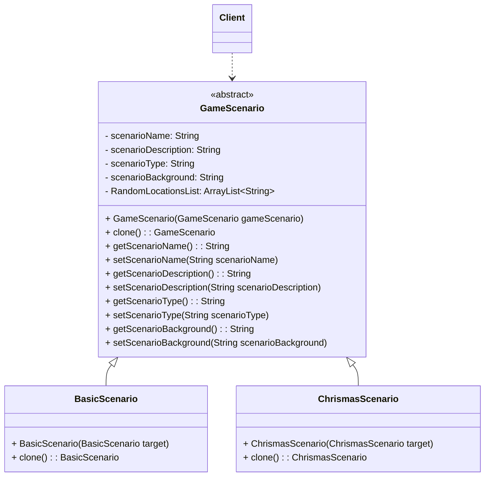

# Diagramas UML

## Prototype - 

```mermaid
classDiagram
    %% Clase abstracta para obtener escenarios
    class GameScenario {
    <<abstract>>
      - scenarioName: String
      - scenarioDescription: String
      - scenarioType: String
      - scenarioBackground: String
      - RandomLocationsList: ArrayList~String~
      + GameScenario(GameScenario gameScenario)
      + clone() : GameScenario
      + getScenarioName() : String
      + setScenarioName(String scenarioName)
      + getScenarioDescription() : String
      + setScenarioDescription(String scenarioDescription)
      + getScenarioType() : String
      + setScenarioType(String scenarioType)
      + getScenarioBackground() : String
      + setScenarioBackground(String scenarioBackground)
    }
    
    %% Implementación concreta de un escenario básico
    class BasicScenario {
      + BasicScenario(BasicScenario target)
      + clone() : BasicScenario
    }
    
    %% Otra implementación concreta para otro escenario
    class ChrismasScenario {
      + ChrismasScenario(ChrismasScenario target)
      + clone() : ChrismasScenario
    }

    class Client{
    }

    Client ..> GameScenario
    GameScenario <|-- BasicScenario
    GameScenario <|-- ChrismasScenario

```
