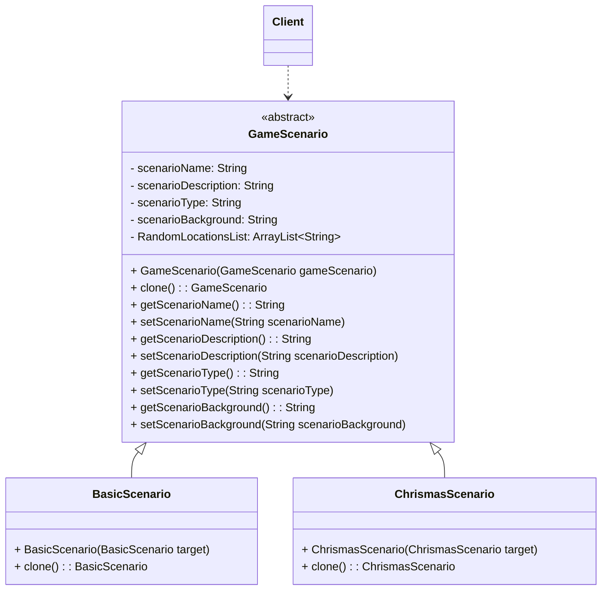
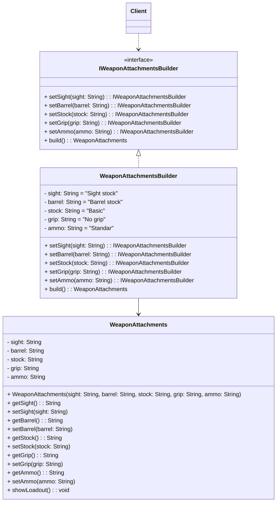

# Diagramas UML

## Patrón Prototype - Lanzamiento de escenarios o mapas al servidor:




## Patrón Builder - Añadir accesorios a las armas




## Patrón Singleton - Administrador de partida privada

```mermaid
    %% Clase con el Singleton
    class GameManager {
        - instance: GameManager
        - players: List~Player~
        - gameStarted: boolean
        - GameManager()
        + getInstance() : GameManager
        + addPlayer(player: Player)
        + removePlayer(player: Player)
        + startGame()
        + endGame()
        - resetInstance()
    }

    %% Clase que se va usar para el ejemplo
    class Player {
        - name: String
        - id: String
        + Player(name: String, id: String)
        + getName() : String
        + getId() : String
    }

    
        class Client{
        
        }
        
    
        Client --> GameManager
        GameManager "1" -- "n" Player

```