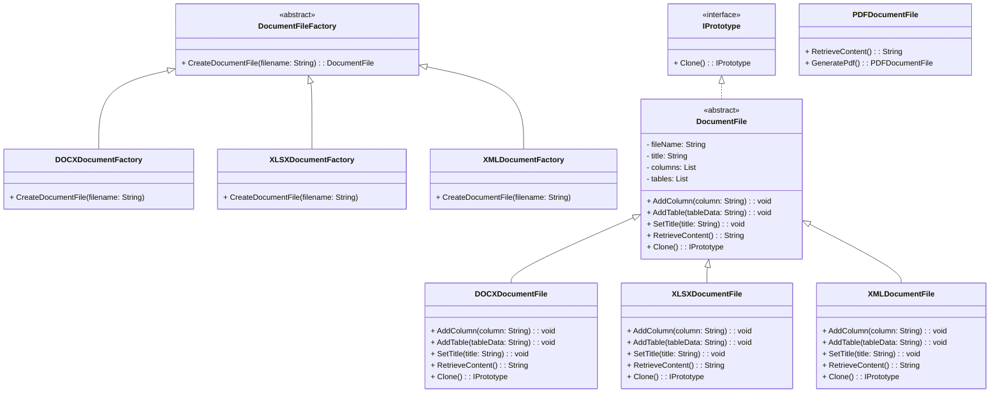
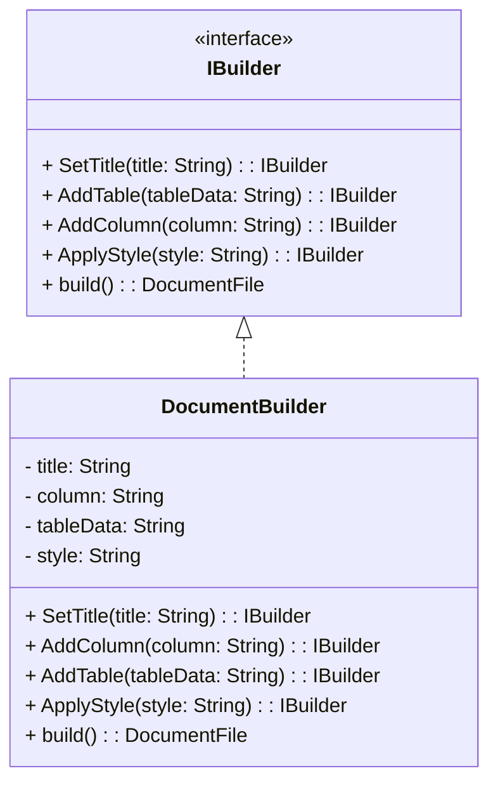

# Diagramas UML

## Patrón Factory Method y Prototype

```mermaid
classDiagram
    %% Clase abstracta para la fábrica de documentos
    class DocumentFileFactory {
    <<abstract>>
      + CreateDocumentFile(filename: String) : DocumentFile
    }
    
    %% Implementación fábrica concreta para documento Word
    class DOCXDocumentFactory {
      + CreateDocumentFile(filename: String)
    }
    
    %% Implementación fábrica concreta para documento Excel
    class XLSXDocumentFactory {
      + CreateDocumentFile(filename: String)
    }

    %% Implementación fábrica concreta para documento XML
    class XMLDocumentFactory {
      + CreateDocumentFile(filename: String)
    }

    %% Interfaz para clonar el documento
    class IPrototype {
        <<interface>>
        + Clone() : IPrototype
    }

    %% Clase abstracta documento
    class DocumentFile {
    <<abstract>>
      - fileName: String
      - title: String
      - columns: List<String>
      - tables: List<String>
      + AddColumn(column: String) : void
      + AddTable(tableData: String) : void
      + SetTitle(title: String) : void
      + RetrieveContent() : String
      + Clone() : IPrototype
    }

    %% clase documento PDF
    class PDFDocumentFile {
      + RetrieveContent() : String
      + GeneratePdf() : PDFDocumentFile
    }

    %% Implementación documento concreto Word
    class DOCXDocumentFile {
      + AddColumn(column: String) : void
      + AddTable(tableData: String) : void
      + SetTitle(title: String) : void
      + RetrieveContent() : String
      + Clone() : IPrototype
    }

    %% Implementación documento concreto Word
    class XLSXDocumentFile {
      + AddColumn(column: String) : void
      + AddTable(tableData: String) : void
      + SetTitle(title: String) : void
      + RetrieveContent() : String
      + Clone() : IPrototype
    }

    %% Implementación documento concreto Word
    class XMLDocumentFile {
      + AddColumn(column: String) : void
      + AddTable(tableData: String) : void
      + SetTitle(title: String) : void
      + RetrieveContent() : String
      + Clone() : IPrototype
    }

    DocumentFileFactory <|-- DOCXDocumentFactory
    DocumentFileFactory <|-- XLSXDocumentFactory
    DocumentFileFactory <|-- XMLDocumentFactory

    IPrototype <|.. DocumentFile
    DocumentFile <|-- DOCXDocumentFile
    DocumentFile <|-- XLSXDocumentFile
    DocumentFile <|-- XMLDocumentFile

```

## Patrón Builder

```mermaid
classDiagram
    %% Interfaz para la construcción
    class IBuilder {
        <<interface>>
        + SetTitle(title: String) : IBuilder
        + AddTable(tableData: String) : IBuilder
        + AddColumn(column: String) : IBuilder
        + ApplyStyle(style: String) : IBuilder
        + build() : DocumentFile
    }

    
    %% Implementación concreta del Builder de los accesorios del arma
    class DocumentBuilder {
        - title: String
        - column: String
        - tableData: String
        - style: String
        + SetTitle(title: String) : IBuilder
        + AddColumn(column: String) : IBuilder
        + AddTable(tableData: String) : IBuilder
        + ApplyStyle(style: String) : IBuilder
        + build() : DocumentFile
    }
    
    IBuilder <|.. DocumentBuilder

```